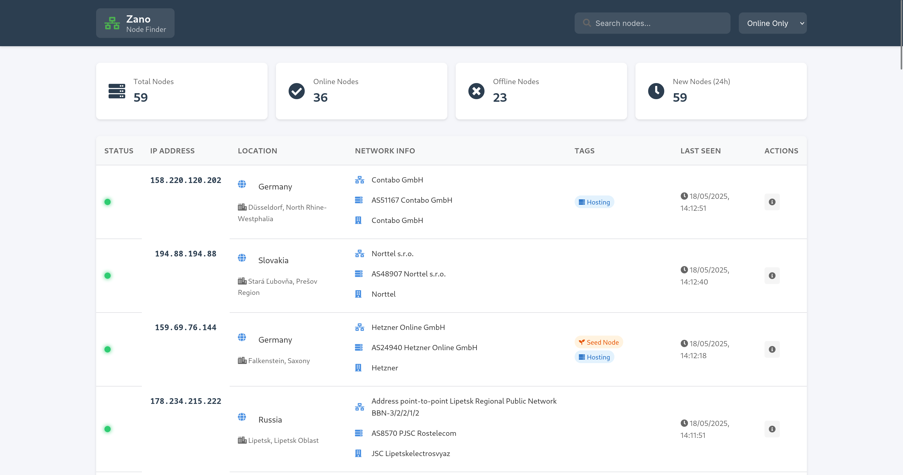

# Zano Peer Finder

A web-based tool for discovering and monitoring Zano network nodes. This tool helps you visualize the Zano network topology, track node status, and analyze network distribution.



## Current Implementation

The current version of Zano Peer Finder discovers nodes by parsing the output of a running `zanod` instance. It reads the standard output and error streams, looking for IP addresses in the logs. This method has some limitations:

- Only discovers nodes that appear in the `zanod` output
- Relies on the node's logging verbosity
- May miss nodes that aren't actively communicating with your node

## Future Improvements

A planned enhancement is to implement direct interaction with the Levin P2P network protocol. This would allow the tool to:
- Actively query the network for peer lists
- Discover more nodes in the network
- Get more accurate and comprehensive network topology data
- Reduce dependency on log parsing

This feature is currently on our TODO list and will be implemented in a future release.

## Features

- Real-time node discovery and monitoring
- Interactive map visualization
- Node status tracking (online/offline)
- Detailed node information (location, ISP, etc.)
- Export node data to text file
- WebSocket-based real-time updates
- Responsive web interface

## Prerequisites

- Go 1.16 or higher
- A Zano node binary (`zanod`)

## Installation

1. Clone the repository:
```bash
git clone https://github.com/yourusername/zano-peer-finder.git
cd zano-peer-finder
```

2. Create a `zano` directory in the project root and place your `zanod` binary there:
```bash
mkdir zano
# Copy your zanod binary to the zano directory
cp /path/to/your/zanod zano/
```

3. Make sure the `zanod` binary is executable:
```bash
chmod +x zano/zanod
```

4. Install dependencies:
```bash
go mod download
```

## Usage

1. Start the application:
```bash
go run cmd/peer-finder/main.go
```

2. Open your web browser and navigate to:
```
http://localhost:8080
```

## Configuration

The application uses the following default settings:
- Web server port: 8080
- Zano RPC port: 11211
- Node ping interval: 2 minutes

## Building

To build the application:
```bash
go build -o zano-peer-finder cmd/peer-finder/main.go
```

## Contributing

Contributions are welcome! Please feel free to submit a Pull Request.

## License

This project is licensed under the MIT License - see the LICENSE file for details.

## Acknowledgments

- Zano Project Team
- OpenStreetMap for map data
- Font Awesome for icons